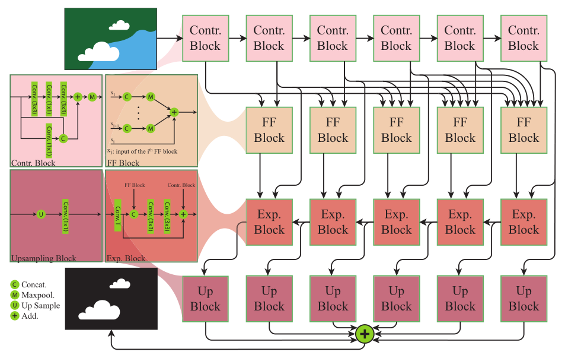

# cloud-net-plus
PyTorch (+Fast.ai) implementation of CloudNet+ for cloud segmentation

Based on https://arxiv.org/abs/2001.08768 -

# This is work in progress
Though the model seems functional, it was not thoroughly tested yet

